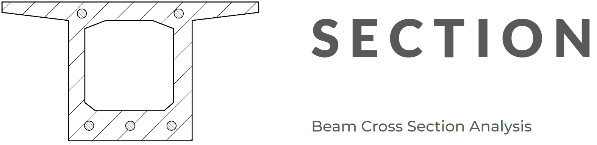

Documentation
=============

*compmec-section* is a python package for beam-section analysis.

.. toctree::
   :maxdepth: 1
   :caption: Using the library:

   rst/installation
   rst/get_started

.. toctree::
   :maxdepth: 2
   :caption: References

   rst/references

.. toctree::
   :maxdepth: 2
   :caption: Theory

   rst/theory

.. toctree::
   :maxdepth: 2
   :caption: Validation

   rst/validation

Support
-------

See `How to contribute <https://github.com/compmec/section/discussions/2>`_ page.
If you find any bug, please raise an issue on the `GitHub issue tracker
<https://github.com/compmec/section/issues>`_ .

If you have a request for a feature to be added to the *compmec-section* package, please don't hesitate to get in touch

License
-------

The project is licensed under the MIT license.
