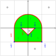

.. _theory:

============
Introduction
============

The main sources of theories, hypothesis and equations are both books:

* Analysis and Design of Elastic Beams, from Walter D. Pilkey
* The Boundary Element Method for Engineers and Scientists, from John T. Katsikadelis

The package's theory can be divided in two parts:

* Geometric calculations, like integration over areas
* Solving Poisson's Equation, used to compute shear and torsion

The geometric calculations, like computing momentum of inertias, are easy developed.
But solving the linear PDE is more challenging and more described through this page. 

While Pilkey's book uses Finite Element Method (FEM for short), their equations must be adapted to Boundary Element Method (BEM for short).
So far, no specific book that uses BEM to compute section properties was found, so we develop some of the equations on this section.

The transformations of equations happens mainly from Green's Theorem and its identities, which are developed in this text. Since the main sources are from these two books, the repeted citations are ommited.

The theory is divided in parts:

1) :ref:`geometric_properties`
2) :ref:`torsion_properties`
3) :ref:`shear_properties`
4) :ref:`stress_and_strain`
5) :ref:`numerical_integration_differences`
6) :ref:`boundary_element_method`

-----------------------------------------------------------------

.. _geometric_properties:

====================
Geometric properties
====================

.. _cross_sectional_area:

Cross-section area
------------------

The cross sectional are is computed by

.. math::
    A = \int_{\Omega} \ dx \ dy

.. _first_moment_area:

First moment of area
--------------------

The first moment of area are computed by

.. math::
    Q_y = \int_{\Omega} x \ dx \ dy
.. math::
    Q_x = \int_{\Omega} y \ dx \ dy

Note that the index :math:`x` and :math:`y`
are switched and they doesn't represent the
internal function

.. _global_second_moment_area:

Second Moment of Area
-----------------------------

The second moment of inertia are

.. math::
    I_{yy} = \int_{\Omega} x^2 \ dx \ dy
.. math::
    I_{xy} = \int_{\Omega} xy \ dx \ dy
.. math::
    I_{xx} = \int_{\Omega} y^2 \ dx \ dy

They are also known as **global second moment of inertia** 

They can be arranged in a tensor form:

.. math::
    \mathbb{I}_{global} = \begin{bmatrix}I_{xx} & I_{xy} \\ I_{xy} & I_{yy}\end{bmatrix}

.. _third_moment_area:

Third Moment of Area
--------------------

The third moment of inertia is computed as:

.. math::
    I_{yyy} = \int_{\Omega} x^3 \ dx \ dy
.. math::
    I_{xyy} = \int_{\Omega} x^2y \ dx \ dy
.. math::
    I_{xxy} = \int_{\Omega} xy^2 \ dx \ dy
.. math::
    I_{xxx} = \int_{\Omega} y^3 \ dx \ dy

They are used in :ref:`shear_center`

.. _geometric_center:

Geometric center
----------------

We denote the geometric centroid by :math:`\boldsymbol{G}`

.. math::
    \boldsymbol{G} = \left(x_{gc}, \ y_{gc}\right)

.. math::
    x_{gc} = \dfrac{Q_y}{A}
.. math::
    y_{gc} = \dfrac{Q_x}{A}

.. _local_second_moment_area:

Local Second Moment of Area
-----------------------------

The local second moment of inertia are computed with respect to the :ref:`geometric_center` :math:`\boldsymbol{G}`

.. math::
    I_{\overline{yy}} = \int_{\Omega} (x-x_{gc})^2 \ dx \ dy = I_{yy} - \dfrac{Q_{y}^2}{A}
.. math::
    I_{\overline{xy}} = \int_{\Omega} (x-x_{gc})(y-y_{gc}) \ dx \ dy= I_{xy} - \dfrac{Q_{x}Q_{y}}{A}
.. math::
    I_{\overline{xx}} = \int_{\Omega} (y-y_{gc})^2 \ dx \ dy= I_{xx} - \dfrac{Q_{y}^2}{A}

They can be arranged in a tensor form:

.. math::
    \mathbb{I}_{local} = \begin{bmatrix}I_{\overline{xx}} & I_{\overline{xy}} \\ I_{\overline{xy}} & I_{\overline{yy}}\end{bmatrix}

.. _radius_gyration:

Radius of Gyration
------------------

The radius of gyration is one mesure of spread the body is.
For a ring, the radius of gyration matches its radius

.. math::
    r_{x} = \sqrt{\dfrac{I_{xx}}{A}}
.. math::
    r_{y} = \sqrt{\dfrac{I_{yy}}{A}}

Principal Axis Properties
-------------------------

The principals moment of inertia are the eigenvalues of the tensor :math:`\mathbb{I}_{local}`, from the :ref:`local_second_moment_area`.

For a 2D matrix, :math:`I_{11}` and :math:`I_{22}` can be easily calculated

.. math::
    \Delta = \sqrt{\left(\dfrac{I_{\overline{xx}}-I_{\overline{yy}}}{2}\right)^2+I_{\overline{xy}}^2}
.. math::
    I_{11} = \dfrac{I_{\overline{xx}}+I_{\overline{yy}}}{2} + \Delta
.. math::
    I_{22} = \dfrac{I_{\overline{xx}}+I_{\overline{yy}}}{2} - \Delta

The direction principal moment of inertia is the eigenvector related to the higher eigenvalue.

It's also computed as 

.. math::
    \phi = \arg\left(I_{\overline{xy}} + i \cdot \left(I_{\overline{xx}}-I_{11}\right)\right) = \text{arctan}\left(\dfrac{I_{\overline{xx}}-I_{11}}{I_{\overline{xy}}}\right)

.. _bending_center:

Bending Center
--------------

The bending center :math:`\mathbf{B}` is the intersection of the two neutral lines when only bending momentums are applied.

From construction, it's the same as the :ref:`geometric_center` :math:`\mathbf{G}`

.. math::
    \mathbf{B} = \left(x_{bc}, \ y_{bc}\right) := \left(x_{gc}, \ y_{gc}\right) = \mathbf{G}

-----------------------------------------------------------------

.. _torsion_properties:

==================
Torsion Properties
==================

.. _warping_function:

Warping Function
----------------

From Saint-venant theory, the warping function :math:`\omega(x, \ y)` is fundamental to compute torsion properties.

From :math:`\omega`, it's possible to find the :ref:`torsion_constant`, :ref:`torsion_center` and stresses/strains due to :ref:`torsion_moment`.

.. math::
    \nabla^2 \omega = 0

.. math::
    \left\langle \nabla \omega, \ \mathbf{n}\right\rangle = \mathbf{n} \times \mathbf{p}

With :math:`\mathbf{p} = (x, \ y)` begin a point on the boundary and :math:`\mathbf{n}` the normal vector at :math:`\mathbf{p}`

This warping function is found by :ref:`boundary_element_method` apart from a constant :math:`c_0`, which is later found in :ref:`torsion_center`.

From now on, we suppose it's already known.

.. _torsion_constant:

Torsion constant
----------------

The torsion constant can be computed

.. math::
    J = I_{xx} + I_{yy} - \mathbb{J}_{\omega}

With

.. math::
    \mathbb{J}_{\omega} = \int_{\Omega} y \dfrac{\partial \omega}{\partial x} - x \dfrac{\partial \omega}{\partial y} \ dx \ dy

We transform this integral into a boundary one

.. math::
    \mathbb{J}_{\omega} = \int_{t_{min}}^{t_{max}} \omega \cdot \left\langle \mathbf{p}, \ \mathbf{p}'\right\rangle \ dt

.. _torsion_center:

Torsion center
---------------

The torsion center :math:`\mathbf{T}` is the point such there's no shear stresses when a torsion moment is applied.

.. math::
    \mathbf{T} = \left(x_{tc}, \ y_{tc}\right)

The quantities :math:`x_{tc}`, :math:`y_{tc}` and :math:`c_0` can be obtained by minimizing the strain energy produced by axial normal warping stresses, which are ignored by Saint-Venant's theory.
Doing so, leads to the linear system

.. math::
    \left(\int_{\Omega} \begin{bmatrix}1 & x & y \\ x & x^2 & xy \\ y & xy & y^2 \end{bmatrix} \ d\Omega\right) \begin{bmatrix}c_0 \\ y_0 \\ -x_0\end{bmatrix} = \int_{\Omega} \omega\begin{bmatrix}1 \\ x \\ y\end{bmatrix} \ d\Omega

The matrix on the left side is already computed in

* :ref:`cross_sectional_area`
* :ref:`first_moment_area`
* :ref:`global_second_moment_area`

while the values on the right side are

.. math::
    Q_{\omega} = \int_{\Omega} \omega \ dx \ dy
.. math::
    I_{x\omega} = \int_{\Omega} x \omega \ dx \ dy
.. math::
    I_{y\omega} = \int_{\Omega} y \omega \ dx \ dy

These integrals are transformed to the boundary equivalent.

.. dropdown:: Boundary reformulation of :math:`Q_{\omega}`, :math:`I_{x\omega}` and :math:`I_{y\omega}` 

    Let :math:`u` be a function such

    .. math::
        \nabla^2 u = g(x, y)

    Select :math:`u` respectivelly as
    
    .. math::
        g_{1}(x, \ y) = 1 \Longrightarrow u_{1} = \frac{1}{4}(x^2+y^2)
    
    .. math::
        g_{x}(x, \ y) = x \Longrightarrow u_{x} = \frac{x^3}{6}
    
    .. math::
        g_{y}(x, \ y) = y \Longrightarrow u_{y} = \frac{y^3}{6}
        
    and use Green's second identity

    .. math::
        \int_{\Omega} \omega \cdot g \ d\Omega & = \int_{\Omega} \omega \nabla^2 u - u \nabla^2 \omega \ d\Omega \\ & = \oint_{\Gamma} \omega \dfrac{\partial u}{\partial n} \ d\Gamma  - u \dfrac{\partial \omega}{\partial n} \ d\Gamma \\ & = \oint_{\Gamma} \omega \dfrac{\partial u}{\partial n} \ d\Gamma - \oint_{\Gamma} u \cdot \langle \mathbf{p}, \ \mathbf{p}'\rangle \ dt

    Transforming to

    .. math::
        Q_{\omega} = \dfrac{1}{2}\int_{t_{min}}^{t_{max}} \omega \cdot \mathbf{p} \times \mathbf{p}' \ dt - \dfrac{1}{4}\int_{t_{min}}^{t_{max}} \langle \mathbf{p}, \ \mathbf{p} \rangle \cdot \langle \mathbf{p}, \ \mathbf{p}' \rangle \ dt

    .. math::
        I_{x\omega} = \dfrac{1}{2} \oint_{\Gamma} \omega \cdot x^2 \ dy - \dfrac{1}{6}\int_{t_{min}}^{t_{max}} x^3 \cdot \langle \mathbf{p}, \ \mathbf{p}' \rangle  \ dt

    .. math::
        I_{y\omega} = \dfrac{-1}{2} \int_{t_{min}}^{t_{max}} \omega \cdot y^2 \ dx - \dfrac{1}{6}\int_{t_{min}}^{t_{max}} y^3 \cdot \langle \mathbf{p}, \ \mathbf{p}' \rangle  \ dt

-----------------------------------------------------------------

.. _shear_properties:

================
Shear properties
================

Functions
----------------

From Saint-venant theory, the functions :math:`\Psi` and :math:`\Phi` are fundamental to compute shear properties.

.. math::
    \begin{bmatrix} \nabla^2 \Psi \\ \nabla^2 \Phi \end{bmatrix} = 
    2\begin{bmatrix} -I_{\overline{xx}} & I_{\overline{xy}} \\ I_{\overline{xy}} & -I_{\overline{yy}} \end{bmatrix} \begin{bmatrix} x \\ y \end{bmatrix}

And boundary conditions

.. math::
    \begin{bmatrix}\nabla \Psi \\ \nabla \Phi\end{bmatrix} \cdot \mathbf{n} = \mathbb{H} \cdot \mathbf{n}
.. math::
    \mathbb{H} = \dfrac{\nu}{2}\left((x^2-y^2)\cdot\begin{bmatrix}I_{xx} & I_{xy} \\ -I_{xy} & -I_{yy}\end{bmatrix} + 2xy \cdot \begin{bmatrix}-I_{xy} & I_{xx} \\ I_{yy} & -I_{xy}\end{bmatrix}\right)

Both equations are in fact Poisson equations. We find them by using the :ref:`boundary_element_method` apart from constants which are computed in :ref:`shear_center` 

.. _shear_center:

Shear center
------------

The shear center :math:`\boldsymbol{S}` is the point which 

.. math::
    \boldsymbol{S} = \left(x_{sc}, \ y_{sc}\right)

.. math::
    \boldsymbol{S} = \dfrac{\nu}{2\Delta}\begin{bmatrix}I_{yy} & I_{xy} \\ I_{xy} & I_{xx}\end{bmatrix}\begin{bmatrix}I_{yyy}+I_{xxy} \\ I_{xyy}+I_{xxx} \end{bmatrix} - \dfrac{1}{\Delta}\int \begin{bmatrix}\Psi \\ \Phi\end{bmatrix} \left\langle \mathbf{p}, \ \mathbf{p}'\right\rangle \ dt

Which values on the left are the :ref:`global_second_moment_area` and :ref:`third_moment_area` and

.. math::
    \Delta = 2(1+\nu)(I_{xx}I_{yy}-I_{xy})

TODO

-----------------------------------------------------------------

.. _stress_and_strain:

=================
Stress and Strain
=================

Introduction
------------

The stress :math:`\boldsymbol{\sigma}` and strain :math:`\boldsymbol{\varepsilon}` are one of the fundamental quantities to evaluate. They arrive from 4 different phenomenums:

* :ref:`axial_force` (1 quantity: :math:`\mathrm{F}_{z}`)
* :ref:`bending_moments` (2 quantities: :math:`\mathrm{M}_{x}` and :math:`\mathrm{M}_{y}`) 
* :ref:`torsion_moment` (1 quantity: :math:`\mathrm{M}_{z}`)
* :ref:`shear_forces` (2 quantities: :math:`\mathrm{F}_{x}` and :math:`\mathrm{F}_{y}`) 

Here we develop expressions to compute stress and strain for any point :math:`\mathbf{p}` inside the section.
The stress and strain tensor in a beam are given by

.. math::
    \boldsymbol{\sigma} = \begin{bmatrix}0 & 0 & \sigma_{xz} \\ 0 & 0 & \sigma_{yz} \\ \sigma_{xz} & \sigma_{yz} & \sigma_{zz}\end{bmatrix} \ \ \ \ \ \ \ \ \ \boldsymbol{\varepsilon} = \begin{bmatrix}\varepsilon_{xx} & 0 & \varepsilon_{xz} \\ 0 & \varepsilon_{yy} & \varepsilon_{yz} \\ \varepsilon_{xz} & \varepsilon_{yz} & \varepsilon_{zz} \end{bmatrix}

The elasticity law relates both tensors 

.. math::
    \boldsymbol{\sigma} = \lambda \cdot \text{trace}\left(\boldsymbol{\varepsilon}\right) \cdot \mathbf{I} + 2\mu \cdot \boldsymbol{\varepsilon}
    
.. math::
    \boldsymbol{\varepsilon} = \dfrac{1+\nu}{E} \cdot \boldsymbol{\sigma} - \dfrac{\nu}{E} \cdot \text{trace}\left(\boldsymbol{\sigma}\right) \cdot \mathbf{I}

With :math:`\lambda` and :math:`\mu` being `Lamé Parameters <https://en.wikipedia.org/wiki/Lam%C3%A9_parameters>`_, :math:`E` beging Young Modulus and :math:`\nu` the Poisson's coefficient.

.. math::
    \lambda = \dfrac{E\nu}{(1+\nu)(1-2\nu)} \ \ \ \ \ \ \ \ \ \ \ \mu = \dfrac{E}{2(1+\nu)}

.. math::
    E = \dfrac{\mu\left(3\lambda+2\mu\right)}{\lambda+\mu} \ \ \ \ \ \ \ \ \ \ \ \nu = \dfrac{\lambda}{2(\lambda+\mu)}

To clear the equations, sometimes we use the pair :math:`\left(\lambda, \ \mu\right)`, other times we use :math:`\left(E, \ \nu\right)`

.. _axial_force:

Axial Force
------------

The axial force only leads to axial stress.
Meaning, in pure axial force case, the stress tensor and strain are given by

.. math::
    \boldsymbol{\varepsilon} =  \begin{bmatrix}\varepsilon_{xx} & 0 & 0 \\ 0 & \varepsilon_{yy} & 0 \\ 0 & 0 & \varepsilon_{zz}\end{bmatrix} \ \ \ \ \ \ \ \ \ \ \ \sigma = \begin{bmatrix}0 & 0 & 0 \\ 0 & 0 & 0 \\ 0 & 0 & \sigma_{zz}\end{bmatrix}

The axial stress is constant when an axial force :math:`\mathrm{F}_{z}` is given by

.. math::
    \sigma_{zz} = \dfrac{\mathrm{F}_{z}}{A}

Where :math:`A` is the :ref:`cross_sectional_area`.

Hence, the strain is given by elasticity law:

.. math::
    \varepsilon_{xx} = \varepsilon_{yy} = -\nu \cdot \dfrac{\mathrm{F}_{z}}{EA}
.. math::
    \varepsilon_{zz} = \dfrac{\mathrm{F}_{z}}{EA}

.. math::
    \boldsymbol{\varepsilon} = \dfrac{\mathrm{F}_{z}}{EA}\begin{bmatrix}-\nu & 0 & 0 \\ 0 & -\nu & 0 \\ 0 & 0 & 1\end{bmatrix}

.. _bending_moments:

Bending Moments
---------------

The bending moments :math:`\mathrm{M}_{x}` and :math:`\mathrm{M}_{y}` causes only axial stresses.
The tensors are 

.. math::
    \boldsymbol{\varepsilon} =  \begin{bmatrix}\varepsilon_{xx} & 0 & 0 \\ 0 & \varepsilon_{yy} & 0 \\ 0 & 0 & \varepsilon_{zz}\end{bmatrix} \ \ \ \ \ \ \ \ \ \ \ \sigma = \begin{bmatrix}0 & 0 & 0 \\ 0 & 0 & 0 \\ 0 & 0 & \sigma_{zz}\end{bmatrix}

The expression of :math:`\sigma_{zz}` depends on the position of the point :math:`\mathbf{p}` in the section. 
In the :ref:`bending_center` :math:`\boldsymbol{B}` the stress and the strain are zero while they increase/decrease depending on the distance to the bending center.

Let :math:`\bar{x}=x-x_{bc}` and :math:`\bar{y}=y-y_{bc}`, the function :math:`\sigma_{zz}(x, \ y)` satisfy

.. math::
    \int_{\Omega} \sigma_{zz} \ d\Omega = 0

.. math::
    \int_{\Omega} \sigma_{zz} \cdot \begin{bmatrix}\bar{y} \\ -\bar{x}\end{bmatrix} \ d\Omega = \begin{bmatrix}M_{x} \\ M_{y}\end{bmatrix}

Add the hypothesis that :math:`\sigma_{zz}` is linear with respect to :math:`x` and :math:`y`, then 

.. math::
    \sigma_{zz}(x, \ y) & = \dfrac{1}{\det \left(\mathbb{I}_{local}\right)} \begin{bmatrix}\bar{y} & \bar{x}\end{bmatrix} \left[\mathbb{I}_{local}\right] \begin{bmatrix}M_{x} \\ M_{y}\end{bmatrix} \\
     & = -\left(\dfrac{I_{\overline{xy}}\mathrm{M}_{x} + I_{\overline{xx}}\mathrm{M}_{y}}{I_{\overline{xx}}I_{\overline{yy}}-I_{\overline{xy}}^2}\right) \cdot \bar{x} + \left(\dfrac{I_{\overline{yy}}\mathrm{M}_{x} + I_{\overline{xy}}\mathrm{M}_{y}}{I_{\overline{xx}}I_{\overline{yy}}-I_{\overline{xy}}^2}\right) \cdot \bar{y}

With constants given in :ref:`local_second_moment_area`

The neutral line is the set of pairs :math:`(x, \ y)` such :math:`\sigma_{zz}(x, \ y) = 0`.
That means the neutral line is the line that pass thought :math:`\boldsymbol{B}` and it's parallel to the vector :math:`\left[\mathbb{I}_{local}\right] \cdot \left(\mathrm{M}_{x}, \ \mathrm{M}_{y}\right)`

It's possible to obtain strain values from elasticity law:

.. math::
    \varepsilon_{xx} = \varepsilon_{yy} = -\nu \cdot \dfrac{\sigma_{zz}}{E}
.. math::
    \varepsilon_{zz} = \dfrac{\sigma_{zz}}{E}

.. math::
    \boldsymbol{\varepsilon} = \dfrac{\sigma_{zz}}{E} \cdot \begin{bmatrix}-\nu & 0 & 0 \\ 0 & -\nu & 0 \\ 0 & 0 & 1\end{bmatrix}

.. _torsion_moment:

Torsion Moment
--------------

The torsion moment :math:`\mathrm{M}_{z}` causes only shear stresses.
The tensors are 

.. math::
    \boldsymbol{\varepsilon} = \begin{bmatrix}0 & 0 & \varepsilon_{xz} \\ 0 & 0 & \varepsilon_{yz} \\ \varepsilon_{xz} & \varepsilon_{yz} & 0\end{bmatrix} \ \ \ \ \ \ \ \ \ \ \ \boldsymbol{\sigma} = \begin{bmatrix}0 & 0 & \sigma_{xz} \\ 0 & 0 & \sigma_{yz} \\ \sigma_{xz} & \sigma_{xz} & 0\end{bmatrix}

The :ref:`warping_function` :math:`\omega` is used to compute them

.. math::
    \sigma_{xz}(x, \ y) = \dfrac{\mathrm{M}_{z}}{J} \cdot \left(\dfrac{\partial \omega}{\partial x} - y\right)
.. math::
    \sigma_{yz}(x, \ y) = \dfrac{\mathrm{M}_{z}}{J} \cdot \left(\dfrac{\partial \omega}{\partial y} + x\right)

.. math::
    \varepsilon_{xz}(x, \ y) = \dfrac{1}{2\mu} \cdot \sigma_{xz}
.. math::
    \varepsilon_{yz}(x, \ y) = \dfrac{1}{2\mu} \cdot \sigma_{yz}

Which :math:`J` is the :ref:`torsion_constant` and :math:`\mu` is the second `Lamé Parameter <https://en.wikipedia.org/wiki/Lam%C3%A9_parameters>`_.

To compute the partial derivatives, two approaches are used:

* For a point :math:`\mathbf{p}` on the boundary

    .. math::
        \nabla \omega & = \dfrac{\partial \omega}{\partial t} \cdot \mathbf{t} + \dfrac{\partial \omega}{\partial n} \cdot \mathbf{n} \\
        & = \left\langle \mathbf{p}, \ \mathbf{t}\right\rangle \cdot \mathbf{n} + \mathbf{t} \cdot \sum_{j=0}^{n-1} \varphi_{j}'(t) \cdot W_{j}

    The derivatives by themselves don't matter, but the evaluation of :math:`\sigma_{xz}` and :math:`\sigma_{yz}`, which are rewritten as 

    .. math::
        \begin{bmatrix}\sigma_{xz} \\ \sigma_{yz}\end{bmatrix} = \dfrac{\mathrm{M}_z}{J} \cdot \left[\left\langle\mathbf{p}, \ \mathbf{n}\right\rangle + \sum_{j=0}^{n-1}\varphi_{j}'(t) \cdot W_{j}\right] \cdot \mathbf{t}
        

* For interior points, :math:`\mathbf{p} \in \text{open}\left(\Omega\right)`

.. _shear_forces:

Shear Forces
------------

The shear forces :math:`\mathrm{F}_{x}` and :math:`\mathrm{F}_{y}` causes only shear stresses. 
The tensors are

.. math::
    \boldsymbol{\varepsilon} = \begin{bmatrix}0 & 0 & \varepsilon_{xz} \\ 0 & 0 & \varepsilon_{yz} \\ \varepsilon_{xz} & \varepsilon_{yz} & 0\end{bmatrix} \ \ \ \ \ \ \ \ \ \ \ \boldsymbol{\sigma} = \begin{bmatrix}0 & 0 & \sigma_{xz} \\ 0 & 0 & \sigma_{yz} \\ \sigma_{xz} & \sigma_{xz} & 0\end{bmatrix}

Depending on the application of the shear force, it may causes torsion.

TODO

-----------------------------------------------------------------

.. _numerical_integration_differences:

=========================================
Numerical Differentiation and Integration
=========================================

To evaluate the matrices :math:`\mathbb{M}` and :math:`\mathbb{F}`,
we use numerical differentiation to estimate the derivative and numerical integration to estimate the defined integral value.

.. _differentiation:

Numerical derivative
--------------------

It's objective to compute the value of :math:`f'(x)` only with values of points nearby.

There are many formulas for it, but here we present only some

.. math::
    f'(x) \approx \dfrac{1}{2h} \cdot \begin{bmatrix}-1 & 0 & 1\end{bmatrix}\begin{bmatrix}f(x-h) \\ f(x) \\ f(x+h)\end{bmatrix}

.. math::
    f'(x) \approx \dfrac{1}{12h} \cdot \begin{bmatrix}-6 & -20 & 36 & -12 & 2\end{bmatrix}\begin{bmatrix}f(x-h) \\ f(x) \\ f(x+h) \\ f(x+2h) \\ f(x+3h)\end{bmatrix}

.. math::
    f'(x) \approx \dfrac{1}{12h} \cdot \begin{bmatrix}1 & -8 & 0 & 8 & -1\end{bmatrix}\begin{bmatrix}f(x-2h) \\ f(x-h) \\ f(x) \\ f(x+h) \\ f(x+2h)\end{bmatrix}

.. math::
    f'(x) \approx \dfrac{1}{12h} \cdot \begin{bmatrix}-2 & 12 & -36 & 20 & 6\end{bmatrix}\begin{bmatrix}f(x-3h) \\ f(x-2h) \\ f(x-h) \\ f(x) \\ f(x+h)\end{bmatrix}

.. _regular_integrals:

Regular integrals
------------------

The numerical integral are computated by using quadrature schemas, rewriting

.. math::
    \int_{0}^{1} f(x) \ dx = \sum_{i=0}^{n-1} w_i \cdot f(x_i)

With specific position nodes :math:`x_i` and weights :math:`w_i`.
:math:`n` is the number of integration points

Depending of the nodes and weights, we get different approximations.
Although the error is unknown, it's still possible to know how good the obtained value is.
It's mesured with constants :math:`n`, :math:`c`, :math:`k` and :math:`m`, depending on the method

.. math::
    \left| \int_{0}^{1} f(x) \ dx - \sum_{i=0}^{n-1} w_i \cdot f(x_i) \right| \le \dfrac{c}{n^{k}} \cdot \max_{x \in \left[0, \ 1\right]} f^{(m)}(x)

.. _polynomial_integrals:

Polynomial integrals
--------------------

To compute area, momentums and inertias, it's needed to compute the integral

.. math::
    I_{a,b} = \int_{\Omega} x^a \cdot y^b \ dx \ dy

Which :math:`\Omega` is the defined region with closed boundary :math:`\Gamma`, :math:`a` and :math:`b` are natural numbers

By using Green's thereom, we transform the integral

.. math::
    \int_{\Omega} \left(\dfrac{\partial Q}{\partial x} - \dfrac{\partial P}{\partial y}\right) \ dx \ dy = \int_{\Gamma} P \ dx + Q \ dy

Without loss of generality, let :math:`\alpha \in \mathbb{R}` and take

.. math::
    \dfrac{\partial Q}{\partial x} = \alpha \cdot x^a \cdot y^b \Longrightarrow Q = \dfrac{\alpha}{a+1} \cdot x^{a+1} \cdot y^b

.. math::
    \dfrac{\partial P}{\partial y} = \left(\alpha-1\right) \cdot x^a \cdot y^b \Longrightarrow P = \dfrac{\alpha - 1}{b+1} \cdot x^{a} \cdot y^{b+1}

Then

.. math::
    I_{a, b} = \dfrac{\alpha - 1}{b+1} \int_{\Gamma} x^{a} \cdot y^{b+1} \ dx + \dfrac{\alpha}{a+1} \int_{\Gamma} x^{a+1} \cdot y^b \ dy

This integral is computed in the boundary and the expression depends on :math:`\alpha`.

In special, by taking :math:`\alpha = \dfrac{a+1}{a+b+2}`, it's transformed to

.. math::
    (a+b+2) \cdot I_{a, b} = \int_{\Gamma} x^a \cdot y^b \cdot \mathbf{p} \times \mathbf{p}' \ dt

Finding :math:`I_{a, b}` it can be easily done with :ref:`regular_integrals`

Polygonal domains
^^^^^^^^^^^^^^^^^

For polygonal domains, :math:`I_{a, b}` can be simplified even more.
In that case, each segment is a straight line, so

.. math::
    \mathbf{p}(t) \times \mathbf{p}'(t) = \mathbf{p}_{i} \times \mathbf{p}_{i+1}

which is constant for an arbitrary segment :math:`i`. Hence

.. math::
    (a+b+2) \cdot I_{a, b} = \sum_{i=0}^{m-1} \left(x_{i}y_{i+1}-x_{i+1}y_{i}\right) I_{a, b}^{(i)}

.. math::
    I_{a, b}^{(i)} = \int_{\Gamma_i} x^a \cdot y^b \ dt

The integral can be computed by expanding it and using the beta function:

.. math::
    \int_{0}^{1} (1-t)^a \cdot t^b \ dt = \dfrac{1}{a+b+1} \cdot \dfrac{1}{\binom{a+b}{a}}

Leading to 

.. math::
    (a+b+1)\binom{a+b}{a} I_{a, b}^{(i)} = \sum_{j=0}^{a}\sum_{k=0}^{b}\binom{j+k}{k}\binom{a+b-j-k}{b-k}x_{i}^{a-j}x_{i+1}^{j}y_{i}^{b-k}y_{i+1}^{k}

Therefore

.. math::
    (a+b+2) (a+b+1)\binom{a+b}{a} I_{a, b} = \sum_{i=0, j=0, k=0}^{m-1,a,b}\binom{j+k}{k}\binom{a+b-j-k}{b-k} x_{i}^{a-j}x_{i+1}^{j} y_{i}^{b-k}y_{i+1}^{k}

For special cases that :math:`a=0` or :math:`b=0`, we get

.. math::
    (a+2)(a+1)I_{a,0} = \sum_{i=0}^{m-1} \left(x_{i}y_{i+1}-x_{i+1}y_{i}\right)\dfrac{x_{i+1}^{a+1}-x_{i}^{a+1}}{x_{i+1}-x_{i}}

.. math::
    (b+2)(b+1)I_{0,b} = \sum_{i=0}^{m-1} \left(x_{i}y_{i+1}-x_{i+1}y_{i}\right)\dfrac{y_{i+1}^{b+1}-y_{i}^{b+1}}{y_{i+1}-y_{i}}

.. note::
    It's possible to have :math:`x_{i+1} = x_{i}` or :math:`y_{i+1} = y_{i}` in some segment, which leads to divide by zero in :math:`I_{a,0}` and :math:`I_{0,b}`.
    
    In that case, the expression is opened:

    .. math::
        \dfrac{z_{i+1}^{c+1}-z_{i}^{c+1}}{z_{i+1}-z_{i}} = \sum_{j=0}^{c} z_{i}^{c-j}z_{i+1}^{j}

.. _singular_integrals:

Singular integrals
------------------

Singular integrals are used when the integrating function is not defined in the entire interval due to singularities.
We decompose the integrating function in two functions:

* The weight function :math:`g(x)`, such contains known singularities
* The integrable function :math:`f(x)`, which is a unknown function defined in all interval

Therefore, we compute

.. math::
    \int_{0}^{1} f(x) \cdot g(x) \ dx \approx \sum_{i=0}^{n-1} w_i \cdot f(x_i)

With :math:`n` specific position nodes :math:`x_i` and weights :math:`w_i`,
computed depending on the fonction :math:`g(x)` and the position of the singularities.

For our specific case,
there are only two types of singular integrals developed in :ref:`boundary_element_method`:

.. math::
    \int_{0}^{1} f(x) \cdot \ln x \ dx

.. math::
    \int_{-1}^{1} f(x) \cdot \dfrac{1}{x} \ dx

.. note::
    The current implementation allows only polygonal domains. Hence, singular integrals are evaluated analiticaly as shown in :ref:`bem_polygonal_domain`

Logarithm singularity
^^^^^^^^^^^^^^^^^^^^^

To compute the :math:`\mathbb{F}` matrix, we are interested in computing

.. math::
    \int_{0}^{1} f(\tau) \cdot \ln \left|\tau - \tau_i\right| \ d\tau

We are interested in computing the integral

.. math::
    I = \int_{0}^{1} f(x) \ \cdot \ln x \ dx

.. math::
    I = \int_{0}^{1} f(x) \ \cdot \ln x \ dx

Describing the function :math:`f(x)` by taylor series

.. math::
    f(x) = \sum_{i=0}^{\infty} a_i \cdot x^{i}

The integral is well defined 

.. math::
    I = - \sum_{i=0}^{\infty} \dfrac{a_i}{\left(1+i\right)^2}

Although it's well defined, in general the :math:`a` coefficients are unknown.

A logarithm quadrature was created by `Stroud and Sladek <https://www.sciencedirect.com/science/article/abs/pii/S0045782597002399>`_ with given values in table bellow

.. math::
    \int_{0}^{1} f(x)\ln x \ dx \approx -\sum_{i=0}^{n-1} w_{i} \cdot f(x_{i})

.. dropdown:: Nodes and Weights for Logarithm Quadrature 

    .. list-table:: 
        :widths: 20 40 40
        :header-rows: 1
        :align: center

        * - :math:`n`
          - :math:`x_i`
          - :math:`w_i`
        * - 2
          - 0.112008806166976
          - 0.718539319030384
        * - 
          - 0.602276908118738
          - 0.281460680969615
        * - 
          - 
          - 
        * - 3
          - 0.0638907930873254
          - 0.513404552232363
        * - 
          - 0.368997063715618
          - 0.391980041201487
        * - 
          - 0.766880303938941
          - 0.0946154065661491
    
Odd singularity
^^^^^^^^^^^^^^^

We are interested in computing the integral

.. math::
    \int_{-1}^{1} \dfrac{1}{x} \cdot f(x) \ dx

The given integral is computed as the Cauchy Principal Value, which symbol is further ommited

.. math::
    PV\int_{-1}^{1} \dfrac{f(x)}{x} \ dx = \lim_{\varepsilon \to 0^{+}} \int_{-1}^{-\varepsilon} \dfrac{f(x)}{x} \ dx + \int_{\varepsilon}^{1} \dfrac{f(x)}{x} \ dx 

This integral is well defined:

.. math::
    \int_{-1}^{1} \dfrac{1}{x} \ dx = 0
.. math::
    \int_{-1}^{1} \dfrac{x}{x} \ dx = 2
.. math::
    \int_{-1}^{1} \dfrac{x^2}{x} \ dx = 0
.. math::
    \int_{-1}^{1} \dfrac{1}{x} \cdot f(x) \ dx = \sum_{j=0}^{\infty} \dfrac{2 \cdot a_{2j+1}}{2j+1}

It's possible to create a quadrature for it:

TODO

-----------------------------------------------------------------

.. _boundary_element_method:

=======================
Boundary Element Method
=======================

Introduction
------------

The Boundary Element Method (BEM for short) is a method that solves a linear PDE by transforming the problem in a boundary problem.
Once the problem is solved, all the informations on the boundary are known and then the interior informations are easy computed after that.

In our case, BEM is used to solve the laplace's equation

.. math:: 
    :label: eq_laplace

    \nabla^2 u = 0

BEM transforms :eq:`eq_laplace` into a boundary version :eq:`eq_bem`

.. math::
    :label: eq_bem

    \varpi\left(\mathbf{s}\right) \cdot u\left(\mathbf{s}\right) = \int_{\Gamma} u \cdot \dfrac{\partial v}{\partial n} \ d\Gamma - \int_{\Gamma} \dfrac{\partial u}{\partial n}  \cdot v \ d\Gamma

Which :math:`\mathbf{s}` is the source point of the Green function :math:`v` and :math:`\varpi(\mathbf{s})` is the winding number

.. math::
    :label: eq_source

    v(\mathbf{p}, \ \mathbf{s}) = \dfrac{1}{2\pi} \ln r = \dfrac{1}{2\pi} \ln \|\mathbf{r}\| = \dfrac{1}{2\pi} \ln \|\mathbf{p} - \mathbf{s}\|

Since all the PDEs used in this package have only Neumann's boundary conditions,
all values of :math:`\dfrac{\partial u}{\partial n}` are known and the objective is finding all the values of :math:`u` at the boundary.

Once :math:`u` and :math:`\dfrac{\partial u}{\partial n}` are both known at the boundary,
it's possible to compute :math:`u(x, y)` and its derivatives at any point inside by using :eq:`eq_bem`.

Discretize solution
------------------------

Parametrize the curve :math:`\Gamma` by :math:`\mathbf{p}(t)` with :math:`m` subdivisions with knots :math:`\left(t_0, \ t_1, \ \cdots, \ t_m\right)`

.. math::
    :label: eq_curve_param

    \mathbf{p}(t) = \sum_{j=0}^{m-1} \phi_{j}(t) \cdot \mathbf{P}_{j} = \langle \mathbf{\phi}(t), \ \mathbf{P}\rangle

Set :math:`u(t)` as a linear combination of :math:`n` basis functions :math:`\varphi(t)` and weights :math:`\mathbf{U}`.

.. math::
    :label: eq_discret_func

    u(t) = \sum_{j=0}^{n-1} \varphi_j(t) \cdot U_j = \langle \mathbf{\varphi}(t), \ \mathbf{U}\rangle

Fix the source point :math:`\mathbf{s}_i = \mathbf{p}(\hat{t}_i)` at the boundary and
expand :eq:`eq_bem` by using :eq:`eq_discret_func` to get :eq:`eq_matrix_formula`

.. math::
    :label: eq_matrix_formula

    \sum_{j=0}^{n-1} \mathbb{W}_{ij} \cdot U_{j} = \sum_{j=0}^{n-1} \mathbb{M}_{ij} \cdot U_{j} - \mathbf{F}_{i}

With the auxiliar values which depends only on the geometry :math:`\mathbf{p}`, the source point :math:`\mathbf{s}` and the basis functions :math:`\varphi`

.. math::
    \mathbb{W}_{ij} = \varpi\left(\mathbf{s}_i\right) \cdot \varphi_j\left(t_i\right)

.. math::
    \mathbb{M}_{ij} = \int_{\Gamma} \varphi_j \cdot \dfrac{\partial v_i}{\partial n} \ d\Gamma

.. math::
    \mathbb{F}_{i} = \int_{\Gamma} \dfrac{\partial u}{\partial n} \cdot v_i \ d\Gamma

Applying for :math:`n` different source points :math:`\mathbf{s}_i` at boundary,
we get the matrices :math:`\mathbb{W}`, :math:`\mathbb{M}` and :math:`\mathbb{F}` such

.. math::
    :label: eq_linear_system

    \left(\mathbb{M}-\mathbb{W}\right) \cdot \mathbf{U} = \mathbb{F}

Finding the values of :math:`\mathbf{U}` means solving the linear system :eq:`eq_linear_system`.
The objective then is computing these matrices to solve :eq:`eq_linear_system`.

General evaluation of matrices
------------------------------

Matrix :math:`\mathbb{W}`
^^^^^^^^^^^^^^^^^^^^^^^^^

The winding number :math:`\varpi` tells the position of a point :math:`\mathbf{s}` with respect to the domain :math:`\Omega`.

- If :math:`\mathbf{s}` is outside :math:`\mathrm{closed}\left(\Omega\right)`, then :math:`\varpi\left(\mathbf{s}\right) = 0`, like in white region
- If :math:`\mathbf{s}` is inside :math:`\mathrm{open}\left(\Omega\right)`, then :math:`\varpi\left(\mathbf{s}\right) = 1`, like in green region
- If :math:`\mathbf{s}` is on the boundary :math:`\partial \Omega`, then :math:`\varpi\left(\mathbf{s}\right) \in \left(0, \ 1\right)`, meaning :math:`\frac{1}{2}` when :math:`\partial \Omega` is smooth at :math:`\mathbf{s}` (red lines).

Then, the value of :math:`\mathbb{W}_{ij}` can be computed as:

.. math::
    \mathbb{W}_{ij} = \varpi\left(\mathbf{s}_i\right) \cdot \varphi_j\left(t_i\right)

For construction of the basis functions :math:`\varphi`, many :math:`\varphi_j\left(t_i\right)` are zero, normally leading :math:`\mathbb{W}` to be a diagonal matrix.

.. note::
    Formal definition: Let :math:`D(\mathbf{c}, \ r)` be a disk of center :math:`\mathbf{c}` and radius :math:`r`, :math:`\varpi(\mathbf{s})` is defined by the limit of the ratio

    .. math::
        \varpi(\mathbf{s}) = \lim_{\delta \to 0^{+}} \dfrac{\mathrm{area}\left(D\left(\mathbf{s}, \ \delta\right) \cap \Omega\right)}{\mathrm{area}\left(D\left(\mathbf{s}, \ \delta\right)\right)}

Matrix :math:`\mathbb{M}`
^^^^^^^^^^^^^^^^^^^^^^^^^

We use

.. math::
    \dfrac{\partial v}{\partial n} ds = \dfrac{1}{2\pi} \cdot \dfrac{\mathbf{r} \times \mathbf{p}'}{\left\langle\mathbf{r}, \ \mathbf{r}\right\rangle} \ dt

to write

.. math::
    \mathbb{M}_{ij} = \dfrac{1}{2\pi} \int_{t_{min}}^{t_{max}} \varphi_{j}(t) \cdot \dfrac{\mathbf{r} \times \mathbf{p}'}{\left\langle\mathbf{r}, \ \mathbf{r}\right\rangle} \ dt

Since the geometry is divided at knots :math:`\left(t_{0}, \ t_{1}, \ \cdots, \ t_{m}\right)`

.. math::
    \mathbb{M}_{ij} = \dfrac{1}{2\pi} \sum_{k=0}^{m-1} \int_{t_{k}}^{t_{k+1}} \varphi_{j}(t) \cdot \dfrac{\mathbf{r} \times \mathbf{p}'}{\left\langle\mathbf{r}, \ \mathbf{r}\right\rangle} \ dt

Change the variable from :math:`t` to :math:`\tau` to get

.. math::
    \mathbb{M}_{ij} = \dfrac{1}{2\pi} \sum_{k=0}^{m-1} \int_{0}^{1} \overline{\varphi}_{j}(\tau) \cdot \dfrac{\mathbf{r} \times \mathbf{p}'}{\left\langle\mathbf{r}, \ \mathbf{r}\right\rangle} \ d\tau

Each integral is easily computed by :ref:`regular_integrals` except for the intervals which :math:`r = 0` and we use :ref:`singular_integrals`.

Matrix :math:`\mathbb{F}`
^^^^^^^^^^^^^^^^^^^^^^^^^

The matrix :math:`\mathbb{F}` contains in fact 3 columns: 1 for warping, 2 for shear.

For the warping function

.. math::
    \dfrac{\partial u}{\partial n} = \mathbf{n} \times \mathbf{p} = \dfrac{\langle \mathbf{p}, \ \mathbf{p}'\rangle}{\|\mathbf{p}'\|}

.. math::
    \mathbb{F}_{i0} = \dfrac{1}{2\pi} \int_{t_{min}}^{t_{max}} \left\langle \mathbf{p}, \ \mathbf{p}'\right\rangle \cdot \ln \|\mathbf{r}_i\| \ dt

.. math::
    \mathbb{F}_{i0} = \dfrac{1}{2\pi}\sum_{k=0}^{m-1} \int_{t_{k}}^{t_{k+1}} \left\langle \mathbf{p}, \ \mathbf{p}'\right\rangle \cdot \ln \|\mathbf{r}_i\| \ dt

.. math::
    \mathbb{F}_{i0} = \dfrac{1}{2\pi} \sum_{k=0}^{m-1} \int_{0}^{1} \left\langle \mathbf{p}, \ \mathbf{p}'\right\rangle \cdot \ln \|\mathbf{r}_i\| \ d\tau

TODO

.. _constraint_solution:

Constraint solution
^^^^^^^^^^^^^^^^^^^

Although the matrix :math:`\left(\mathbb{M}-\mathbb{W}\right)` is not singular, all the PDEs have Neumann's boundary conditions hence there's no unique solution.
If :math:`u^{\star}` is found as solution, then :math:`\left(u^{\star} + \text{const}\right)` also is a solution.

Although both functions give the same properties cause they uses only the derivatives of :math:`u`, we restrict the solution by solving the system with Lagrange Multiplier.

.. math::
    \begin{bmatrix}K & \mathbf{C} \\ \mathbf{C}^T & 0\end{bmatrix} \begin{bmatrix}\mathbf{U} \\ \lambda \end{bmatrix} = \begin{bmatrix}\mathbb{F} \\ 0\end{bmatrix}

Which vector :math:`\mathbf{C}` is a vector of ones.

The determination exacly of the constant depends on the problem and are better treated in :ref:`torsion_center` and :ref:`shear_center`.

.. _bem_polygonal_domain:

Polygonal evaluation of matrices
--------------------------------

For polygonal domains, when the basis functions :math:`\phi(t)` are piecewise linear, some computations becomes easier.
The :math:`m` vertices are placed at knots :math:`\left(t_0, \ t_1, \ \cdots, \ t_m\right)`.

For an arbitrary interval :math:`\left[t_k, \ t_{k+1}\right]`, :math:`\mathbf{p}(t)` is described as :math:`\mathbf{p}_{k}(\tau)`

.. math::
    \mathbf{p}_{k}(\tau) = \mathbf{P}_{k} + \tau \cdot \mathbf{V}_k
    
.. math::
    \mathbf{V}_k = \mathbf{P}_{k+1} - \mathbf{P}_{k}

.. math::
    \tau = \dfrac{t - t_{k}}{t_{k+1} - t_{k}} \in \left[0, \ 1\right]

Since the source point lies on the boundary at parameter :math:`\hat{t}_i`, meaning :math:`\mathbf{s}_i = \mathbf{p}(t_i)`, then

* If :math:`\hat{t}_i \notin \left[t_{k}, \ t_{k+1}\right]` then
    
    .. math::
        \mathbf{r}(\tau) = \left(\mathbf{P}_{k}-\mathbf{s}_i\right) + \tau \cdot \mathbf{V}_{k}

* Else

    .. math::
        \hat{\tau}_i = \dfrac{\hat{t}_i - t_{k}}{t_{k+1} - t_{k}}\in \left[0, \ 1\right]

    .. math::
        \mathbf{r}(\tau) = \left(\tau-\tau_i\right) \cdot \mathbf{V}_{k}

For further computations, let

.. math::
    \alpha_k = \left\langle \mathbf{P}_k, \ \mathbf{V}_k\right\rangle
.. math::
    \beta_k = \left\langle \mathbf{V}_k, \ \mathbf{V}_k\right\rangle

Matrix :math:`\mathbb{W}`
^^^^^^^^^^^^^^^^^^^^^^^^^

If the source point :math:`\mathbf{s}_i` lies in the middle of the segment

.. math::
    \varpi\left(\mathbf{s}_i\right) = \dfrac{1}{2}

If the source point :math:`s_i` lies in the vertex :math:`P_{k}`, meaning :math:`\hat{t}_i = t_{k}` then

.. math::
    \varpi\left(\mathbf{s}_i\right) = \dfrac{1}{2\pi}\arg\left(-\langle\mathbf{V}_{k-1}, \ \mathbf{V}_{k} \rangle + i \cdot \mathbf{V}_{k-1} \times \mathbf{V}_{k}\right)

.. note::
    The function ``arctan2`` can be used in place of :math:`\arg`

Matrix :math:`\mathbb{M}`
^^^^^^^^^^^^^^^^^^^^^^^^^

So far

.. math::
    \mathbb{M}_{ij} = \dfrac{1}{2\pi} \sum_{k=0}^{m-1} \int_{0}^{1} \overline{\varphi}_{j}(\tau) \cdot \dfrac{\mathbf{r} \times \mathbf{p}'}{\left\langle\mathbf{r}, \ \mathbf{r}\right\rangle} \ d\tau

* If :math:`\hat{t}_i \in \left[t_k, \ t_{k+1}\right]`

    .. math::
        \mathbf{p}_k(\tau) = \mathbf{P}_k + \tau \cdot \mathbf{V}_{k} 
    .. math::
        \mathbf{r}(\tau) = \left(\tau-\hat{\tau}_i\right) \cdot \mathbf{V}_{k} 
    .. math::
        \mathbf{r} \times \mathbf{p}' = \left(\tau-\hat{\tau}_i\right) \cdot \mathbf{V}_{k} \times \mathbf{V}_{k} = 0 

    Therefore, we can ignore the integration over the interval which the source lies on

Matrix :math:`\mathbb{F}`
^^^^^^^^^^^^^^^^^^^^^^^^^

So far, there's three functions:

.. math::
    \mathbb{F}_{i0} = \dfrac{1}{2\pi} sum_{k=0}^{m-1} \int_{0}^{1} \left\langle \mathbf{p}, \ \mathbf{p}'\right\rangle \cdot \ln \|\mathbf{r}\| \ \tau
.. math::
    \mathbb{F}_{i1} = \mathrm{unknown}
.. math::
    \mathbb{F}_{i2} = \mathrm{unknown}

For warping function, the expression :math:`\mathbb{F}_{i0}` is written as
    
.. math::
    \mathbb{F}_{i0} = \dfrac{1}{2\pi} \sum_{k=0}^{m-1} \int_{0}^{1} \left(\alpha_k + \tau \cdot \beta_k \right) \ln\|\mathbf{r}\| \ d\tau

* If :math:`\hat{t}_i \in \left[t_k, \ t_{k+1}\right]`, then

    .. math::
        \mathbf{F}_{i0k} = & \left(\alpha_{k} + \dfrac{1}{2}\beta_{k}\right) \cdot \dfrac{1}{2} \ln \beta_k \\
                & + \alpha_{k} \int_{0}^{1} \ln |\tau-\hat{\tau}_i| d\tau \\
                & + \beta_k \int_{0}^{1} \tau \cdot \ln |\tau-\hat{\tau}_i| \ d\tau 

    These two logarithm integrals are well defined and has exact value.
    The expressions depends on the value of :math:`\hat{\tau}_i`:

    .. list-table:: Values of logarithm integrals
        :widths: 20 40 40
        :header-rows: 1
        :align: center

        * - :math:`\hat{\tau}_i`
          - :math:`\int_0^1 \ln\left|\tau-\hat{\tau}_i\right| d\tau`
          - :math:`\int_0^1 \tau\ln\left|\tau-\hat{\tau}_i\right| d\tau`
        * - :math:`0`
          - :math:`-1`
          - :math:`\frac{-1}{4}`
        * - :math:`\frac{1}{2}`
          - :math:`-(1+\ln 2)`
          - :math:`\frac{-1}{2}\left(1+\ln 2\right)`
        * - :math:`1`
          - :math:`-1`
          - :math:`\frac{-3}{4}`

    * For :math:`0 < \hat{\tau}_i < 1`, then
        
        .. math::
            \int_{0}^{1} \ln |\tau-\hat{\tau}_i| d\tau = & \hat{\tau}_i \ln \hat{\tau}_i + (1-\hat{\tau}_i)\ln \left(1-\hat{\tau}_i\right) - 1 \\
            \int_{0}^{1} \tau \cdot \ln |\tau-\hat{\tau}_i| d\tau = & \dfrac{-1}{4}\hat{\tau}_i^2\left(3 - 2\ln \hat{\tau}_i\right) \\ & - \dfrac{1}{4}\left(1-\hat{\tau}_i\right)\left(1+3\hat{\tau}_i-2\left(1+\hat{\tau}_i\right)\ln \left(1-\hat{\tau}_i\right)\right)
    
